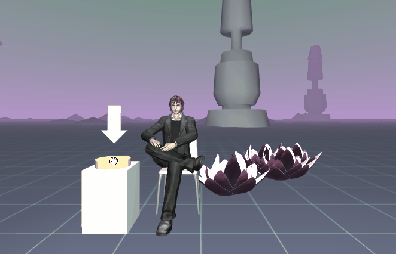

# VR Aframe Interactions
Lotus Spawner

 
• A-Frame component for instantiating virtual elements  
• A-Frame component for destroying virtual elements  
• A-Frame component that allows for selection, manipulation, and release (e.g. picking up and rotating) 
• Add sound and/or music to scene for feedback and ambience. 
• Code should work on both platforms chosen (though it might work slightly differently on each)  
• use source-control in application development  

<b>OVERVIEW</b> 
This application allows users to spawn virtual flowers. Clicking the button creates a flower at a random location, 
 clicking the flower removes it from the scene. Background music added for feedback and ambience.   
  

